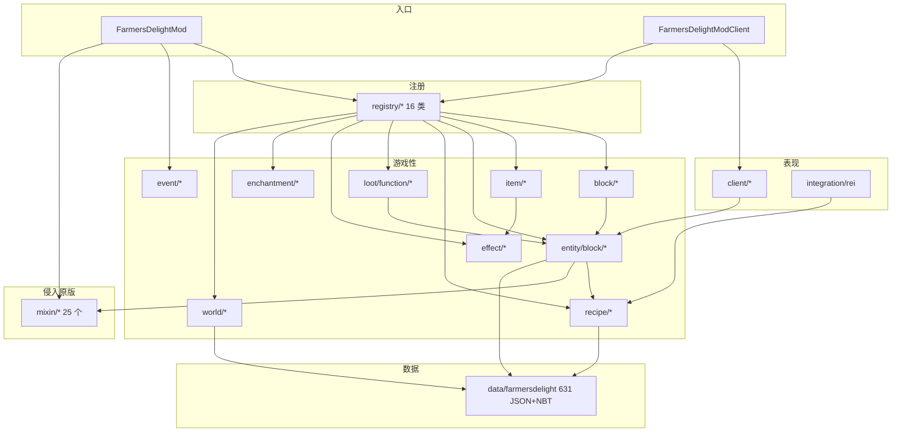

# 01 — 项目架构报告

> 所有 `文件:行号` 均相对 `src/main/java/com/nhoryzon/mc/farmersdelight/`（另行注明者除外）。

## 1. 技术栈与构建

- **构建**：Gradle 8.1.1（wrapper）+ fabric-loom `1.1.+` + `maven-publish` + `net.researchgate.release 2.8.1`（`build.gradle:1-5`）。
- **Java 17**（`build.gradle:7-8`），UTF-8 编译（`build.gradle:78-81`）。
- **依赖**（`build.gradle:29-58`）：
  - 运行时必需：Minecraft 1.20.1、yarn 1.20.1+build.9、fabric-loader 0.14.21、fabric-api 0.85.0+1.20.1；
  - `modCompileOnly`（软依赖，编译期可见）：ModMenu 7.1.0、Cloth Config 11.1.106、REI 12.0.626（+Architectury 9.1.10 仅本地运行时）。
- **资源处理**（`build.gradle:60-76`）：`processResources` 把 `${version}`、`${loader_version}` 等展开进 `fabric.mod.json`，把 `archivesBaseName` 展开进 `farmersdelight.mixins.json`（refmap 名）。
- **产物**：含 sources-jar 与 javadoc-jar（`build.gradle:83-86`）。

## 2. 运行入口（fabric.mod.json entrypoints）

| 入口 | 类 | 端 | 作用 |
|---|---|---|---|
| `main` | `FarmersDelightMod` | 双端 | 全部注册逻辑 |
| `client` | `FarmersDelightModClient` | 仅客户端 | 渲染器/粒子/界面/HUD 注册 |
| `rei_client` | `integration.rei.FarmersDelightModREI` | 仅客户端 | REI 配方展示插件 |
| `modmenu` | `integration.modmenu.FarmersDelightModMenu` | 仅客户端 | ModMenu 配置入口（`Category.java`/`Entry.java`） |

依赖声明：`fabricloader >= 0.14.21`、`fabric >= 0.83.0+1.20`、`minecraft ~1.20`（`fabric.mod.json#depends`）。

## 3. 包结构与职责分层

```
com.nhoryzon.mc.farmersdelight
├── FarmersDelightMod / FarmersDelightModClient / Configuration   【入口/配置层】
├── registry/        【内容注册层】16 个枚举注册表
├── block/           【方块层】45+ 方块类（交互、状态、放置规则）
│   ├── signs/       画布告示牌（立式/墙挂 + ICanvasSign 接口）
│   └── state/       CookingPotSupport 等自定义状态枚举
├── entity/          【实体层】RottenTomatoEntity 投掷物
├── entity/block/    【方块实体层】游戏性核心
│   ├── dispenser/   发射器切割行为
│   ├── inventory/   容器抽象（ItemStackInventory/CookingPotInventory/RecipeWrapper）
│   │   └── slot/    烹饪锅三个专用槽
│   └── screen/      CookingPotScreenHandler（唯一自研 ScreenHandler）
├── item/            【物品层】18 个物品类
│   ├── enumeration/ Foods（食物数据中心）、ToolMaterials（燧石材质）
│   └── material/    FlintMaterial（死代码，见 §8）
├── recipe/          【配方层】CookingPotRecipe/CuttingBoardRecipe + 序列化器
│   └── ingredient/  ChanceResult（概率产出，源自 Create 团队）
├── loot/function/   【战利品函数】CopyMeal/CopySkillet/SmokerCook
├── effect/          【状态效果】Comfort/Nourishment
├── enchantment/     【附魔】BackstabbingEnchantment
├── advancement/     【进度判据】CuttingBoardTrigger
├── event/           【事件监听】Knives/CuttingBoard/LivingEntityFeedItem
├── mixin/           【原版行为修改层】25 个 Mixin + util/BeforeInc 自定义注入点
├── world/           【世界生成】feature/configuration/placement
├── client/          【表现层】gui(HUD)/particle/render(block,item)/screen
├── integration/     【第三方集成】rei/、modmenu/
├── util/            【工具】MathUtils/RecipeMatcher/BlockStateUtils/CompoundTagUtils/WorldEventUtils
└── exception/       SlotInvalidRangeException
```

分层判定依据：调用方向基本单向 `client → block/item → entity/block → recipe/registry → minecraft API`；`mixin/` 是唯一横向侵入原版的层。

## 4. 注册表体系（registry/，16 个类）

全部为**枚举 + `registerAll()` 模式**：枚举项携带 `(path, Supplier)`，统一 `Registry.register` 到原版 `Registries.*`，并暴露 `Lazy<T> get()`。

| 注册表 | 目标 Registry | 数量/内容 |
|---|---|---|
| `BlocksRegistry` | `Registries.BLOCK` | 90 项（stove、cooking_pot、cutting_board、basket、8 木种 cabinet、rich_soil 系、rope、水稻三件套、番茄两件套、蘑菇菌落、盛宴四件套、pie、tatami 三件套、画布告示牌等）；枚举内另有 `registerRenderLayer()`（`BlocksRegistry.java` 客户端渲染层）与可燃物注册（`FlammableBlockRegistry`，import 见文件头） |
| `ItemsRegistry` | `Registries.ITEM` | 158 项；五把刀（`:139-143`）、碗装食物统一经 `ModItemSettings.food(Foods, Items.BOWL, 16)`（`item/ModItemSettings.java:22-24`） |
| `EffectsRegistry` | `Registries.STATUS_EFFECT` | nourishment、comfort（`EffectsRegistry.java:12-13`） |
| `BlockEntityTypesRegistry` | `Registries.BLOCK_ENTITY_TYPE` | stove/cooking_pot/cutting_board/basket/cabinet/canvas_sign/skillet |
| `RecipeTypesRegistry` | `RECIPE_SERIALIZER` + `RecipeType` | `farmersdelight:cooking`、`farmersdelight:cutting`（`RecipeTypesRegistry.java:19-20`，懒加载单例 `:42-58`） |
| `LootFunctionsRegistry` | `LOOT_FUNCTION_TYPE` | copy_meal、smoker_cook、copy_skillet（`:17-20`） |
| `EnchantmentsRegistry` | `Registries.ENCHANTMENT` | backstabbing（`:13`） |
| `EntityTypesRegistry` | `Registries.ENTITY_TYPE` | rotten_tomato（`:15-18`） |
| `ParticleTypesRegistry` | `PARTICLE_TYPE` | star、steam |
| `SoundsRegistry` | `Registries.SOUND_EVENT` | 全部模组音效（14 个 OGG 于 `assets/.../sounds/`） |
| `AdvancementsRegistry` | Fabric `CriterionRegistry` | `CUTTING_BOARD` 判据（`:11`） |
| `ExtendedScreenTypesRegistry` | Fabric `ExtendedScreenHandlerType` | cooking_pot GUI |
| `ConfiguredFeaturesRegistry`/`BiomeFeaturesRegistry`/`PlacementModifiersRegistry` | worldgen 相关注册表 | `wild_crop`/`wild_rice` Feature 类型、`biome_is_overworld` 放置修饰器、8+2 个特征 key（数据驱动） |
| `TagsRegistry` | —（常量） | `HEAT_SOURCES`/`HEAT_CONDUCTORS`（`:22-23`）、`KNIVES`、`MINABLE_KNIFE` 等标签 Identifier 常量 |

**注册顺序**（`FarmersDelightMod.onInitialize:104-118`）：Blocks → Items → Effects → BlockEntityTypes → Sounds → Advancements → RecipeTypes → LootFunctions → ExtendedScreens → Particles → Enchantments → ConfiguredFeatures → BiomeFeatures → PlacementModifiers → EntityTypes（顺序有依赖含义：Item 依赖 Block，BE 类型依赖 Block/BE 类）。

## 5. Mixin 清单（对原版的侵入面，升级时的高风险点）

配置：`src/main/resources/farmersdelight.mixins.json`（priority 1100，JAVA_17，`defaultRequire: 1`）。

### 5.1 通用（19 个，mixin/ 根包）

| Mixin | 注入目标 | 功能 |
|---|---|---|
| `AnyPlantOnRichSoilFarmLandMixin:16-23` | PitcherCrop/Crop/AttachedStem/StemBlock 的 `canPlantOnTop`（TAIL, cancellable） | 任意作物可种在沃土农田上 |
| `PlantBlockOnRichSoilMixin:13-18` | PlantBlock.`canPlantOnTop` | 通用植物可种在沃土 |
| `DeadBushBlockOnRichSoilMixin:13-18` | DeadBushBlock.`canPlantOnTop` | 枯灌木可种在沃土 |
| `ChickenEntityBreedingMixin:12-21` | ChickenEntity.`isBreedingItem` | 鸡额外吃甘蓝/番茄种子/稻子 |
| `PigEntityBreedingMixin:12-20` | PigEntity.`isBreedingItem` | 猪额外吃甘蓝/番茄 |
| `CampfireBaleMixin:15-23` | CampfireBlock.`isSignalFireBaseBlock` | 稻草捆/稻捆可作信号火基座 |
| `EnchantmentEnhancementMixin:12-35` | Enchantment.`isAcceptableItem` | 刀/煎锅的附魔白名单 |
| `EnchantmentHelperEnhancementMixin:18-40` | EnchantmentHelper.`getPossibleEntries` | 附魔台候选修正；防止背刺出现在普通武器 |
| `ItemMixin:16-28` | Item.`getMaxCount` | 原版汤可堆叠至 16（配置开关） |
| `LivingEntityBackstabbingEnchantmentMixin:18-34` | LivingEntity/PlayerEntity.`damage`（@ModifyVariable argsOnly） | 背刺伤害倍率注入 |
| `LivingEntityKnockBackMixin:13-27` | LivingEntity.`takeKnockback` | 刀击退 -0.1、煎锅击退 ×2 |
| `LivingEntityOnUseItemFinishMixin:20-37` | ItemStack.`finishUsing` | 兔子煲跳跃提升、comfort_foods 标签汤给舒适效果 |
| `PlayerEntityAttackWithSkilletMixin:15-31` | PlayerEntity.`attack` | 煎锅攻击强弱击音效 |
| `StewItemMixin:16-35` | StewItem.`finishUsing` | 原版汤吃完返还碗 |
| `MigrationBlockEntityMixin:21-38` † | BlockEntity.`createFromNbt` | `pantry→cabinet` BE ID 迁移 |
| `MigrationBlockRegistryMixin:18-43` † | SimpleDefaultedRegistry.`get` | 8 种 `*_pantry→*_cabinet`、`rice_crop→rice`、`rice_upper_crop→rice_panicle` 方块 ID 迁移 |
| `MigrationItemStackMixin:19-43` † | ItemStack.`fromNbt` | 物品形态 pantry→cabinet 迁移 |

† 三个 Migration mixin 已标注 `@Deprecated(forRemoval=true, since="1.4.0")`，属计划移除的过渡代码。

### 5.2 客户端（3 个）

- `CanvasSignEditScreenMixin:16-31` — 告示牌编辑界面背景改画布贴图（@Redirect `getSignTextureId`）。
- `InGameHudMixin:14-24` — 在饥饿条渲染后经自定义注入点 `BeforeInc`（`mixin/util/BeforeInc.java:38-66`，匹配 `iinc -10` 指令）调用 `NourishmentHungerOverlay` / `ComfortHealthOverlay`。
- `accessors.AbstractSignEditScreenAccessorMixin:8-12` — 暴露编辑界面 BE。

### 5.3 Accessor/Invoker（6 个）

| Mixin | 暴露内容 | 使用方 |
|---|---|---|
| `DispenserBehaviorsAccessorMixin:11-14` | `DispenserBlock.BEHAVIORS` 静态表 | `CuttingBoardDispenseBehavior.java:26`（保存原行为以便回退） |
| `ParrotsTamingIngredientsAccessorMixin:10-14` | `ParrotEntity.TAMING_INGREDIENTS` | `FarmersDelightMod.java:127-130` 追加驯服食物 |
| `PlayerExhaustionAccessorMixin:7-10` | `HungerManager.exhaustion` | `NourishmentEffect.java:30` |
| `RecipeManagerAccessorMixin:13-17` | `RecipeManager.getAllOfType`（@Invoker） | 三个烹饪 BE 的配方直查 |
| `StructurePoolAccessorMixin:13-24` | `StructurePool.elements/elementCounts`（含 @Mutable setter） | `FarmersDelightMod.addToStructurePool:155-169` 村庄注入 |

## 6. 类继承体系

### 6.1 方块（block/）

```
BlockWithEntity
├── InventoryBlockWithEntity（抽象，统一掉落+比较器，InventoryBlockWithEntity.java:11）
│   ├── BasketBlock（篮子，面向吸取）
│   └── CabinetBlock（橱柜）
├── CookingPotBlock（+InventoryProvider+Waterloggable）
├── CuttingBoardBlock（+Waterloggable）
├── StoveBlock
└── SkilletBlock

CropBlock → Cabbage/Onion/TomatoVine/RiceUpper(Crop)
PlantBlock → BuddingBush(→BuddingTomato) / RiceCrop / MushroomColony / WildPatch(→WildCrop) / SandyShrub
FarmlandBlock → RichSoilFarmlandBlock
PaneBlock → RopeBlock     Block → RichSoil / SafetyNet / FeastBlock(→4 盛宴子类) / PieBlock / Tatami 系 / OrganicCompost / CanvasRug / RiceBale(FacingBlock)
SignBlock/WallSignBlock → Standing/WallCanvasSignBlock（+ICanvasSign）
```

### 6.2 方块实体（entity/block/）

```
BlockEntity
├── SyncedBlockEntity（抽象：toUpdatePacket + inventoryChanged 广播，SyncedBlockEntity.java:14-36）
│   ├── CookingPotBlockEntity（+CookingPotInventory+HeatableBlockEntity+Nameable）
│   ├── CuttingBoardBlockEntity（+ItemStackInventory）
│   └── SkilletBlockEntity（+ItemStackInventory+HeatableBlockEntity）
├── StoveBlockEntity（+Clearable）
├── BasketBlockEntity → LootableContainerBlockEntity（+Hopper 语义）
├── CabinetBlockEntity → LootableContainerBlockEntity
└── CanvasSignBlockEntity → SignBlockEntity
```

### 6.3 物品（item/）

```
Item → ConsumableItem（汤碗容器返还 + 食物效果 tooltip 基类）
        ├── DrinkableItem → MelonJuiceItem
        ├── MilkBottleItem → HotCocoaItem
        ├── PopsicleItem
        └── LivingEntityFeedItem(抽象) → DogFoodItem / HorseFeedItem
Item → KelpRollItem（慢食 64 tick）/ RottenTomatoItem（投掷）
MiningToolItem → KnifeItem（+雕刻南瓜）
BlockItem → ModBlockItem → RopeItem（向下延伸放置）/ MushroomColonyBlockItem
BlockItem → SkilletItem（手持烹饪，NBT 驱动）
```

## 7. 核心模块依赖图



要点：
- **`registry/` 是全项目的汇聚点**——每个注册表枚举直接引用 block/item/entity 等具体类，形成事实上的「内容清单」。
- **`mixin/` 被三处依赖**：主入口（注册期调用 accessor）、方块实体（配方直查）、效果（疲惫度读取），因此 Mixin 不是纯旁路，而是游戏性主链路的一环。
- **数据包（data/）与代码的契约**：`recipe/` 序列化器定义 JSON 格式 ↔ `data/farmersdelight/recipes/`；`TagsRegistry` ↔ `data/.../tags/`；`ConfiguredFeaturesRegistry` ↔ `worldgen/`；`registerLootTable()`（`FarmersDelightMod.java:257-300`）↔ `loot_tables/inject/`。

## 8. 显著设计模式与约定

| 模式 | 位置 | 说明 |
|---|---|---|
| **枚举注册表** | `registry/` 全部 | 用枚举常量承载 (id, supplier)，`Lazy` 延迟取值，避免注册期类加载顺序问题 |
| **模板方法** | `ConsumableItem.affectConsumer`（`:92`）、`BuddingBushBlock.growPastMaxAge`（`:107`） | 基类定流程、子类填行为 |
| **策略** | `CuttingBoardRecipe` 的 `Ingredient tool`；槽位类 `CookingPotMealSlot/BowlSlot/ResultSlot` | 工具/槽行为可插拔 |
| **观察者/事件** | `event/` 三监听器 + Fabric API 回调 | 游戏性挂钩不侵入原版 |
| **缓存** | 三个烹饪 BE 的 `lastRecipeID` + `RecipeManagerAccessorMixin.getAllForType`（如 `CookingPotBlockEntity.java:203-215`） | 每 tick 配方查询的性能关键路径 |
| **NBT 快照** | `CookingPotBlockEntity.writeMeal:122`、`SkilletBlockEntity.writeSkilletItem:192` + `loot/function/Copy*` | 掉落物携带完整运行时状态，重放恢复 |
| **SidedInventory 分面** | `CookingPotInventory.java:13-42` | 漏斗交互方向规则（上入食材、下出成品、侧入容器） |
| **自定义 Mixin 注入点** | `mixin/util/BeforeInc` | 匹配字节码 iinc 指令，HUD 精确插入 |

## 9. 架构层面的债务/风险清单

1. **无测试**：`gradle test` 空跑；回归完全依赖手工游戏内验证。
2. **Mixin 密度高**（25 个）：MC 版本升级时 `canPlantOnTop`、`damage`、`finishUsing` 等注入点的 yarn 映射名变动会直接编译失败——这是移植版每次跨版本的主工作量。
3. **死代码**：`item/material/FlintMaterial.java` 全库无引用（实际使用 `item/enumeration/ToolMaterials.FLINT`，见 `ItemsRegistry.java:139`）。
4. **疑似 bug**：`CabinetBlockEntity.onClose:107-111` 调用 `viewerManager.openContainer(...)` 而非 close，靠 `tick():144-164` 的兜底逻辑校正。
5. **未接通的数据**：`worldgen/configured_feature/patch_{brown,red}_mushroom_colony.json` 无对应 placed_feature 且代码未挂接（自然菌落生成不生效，菌落实际由沃土转化产生，`RichSoilBlock.java:78-87`）。
6. **GUI 同步尺寸不一致**：`CookingPotScreenHandler.java:84` 客户端 `ArrayPropertyDelegate(4)` vs 服务端 sync data size 2（`CookingPotBlockEntity.java:496`），当前仅读 0/1 索引未触发故障。
7. **CI 与仓库不一致**：CircleCI release 任务 `git checkout --force develop`，但仓库无 develop 分支（详见 `note/03-workflow.md` §1）。
