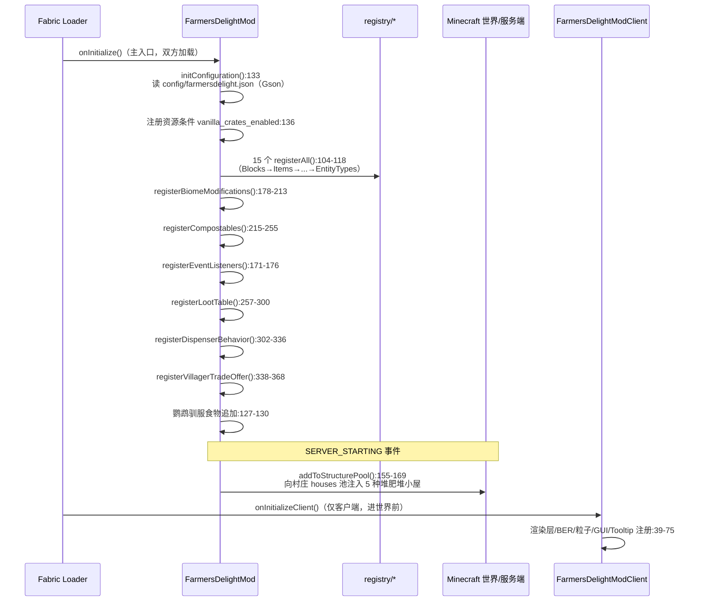

# 02 — 项目运行原理报告

> 所有 `文件:行号` 均相对 `src/main/java/com/nhoryzon/mc/farmersdelight/`。
> Fabric 模组没有 `main()`；「启动」= Loader 按生命周期回调 entrypoint，「运行」= 方块 Ticker / 随机刻 / 事件回调驱动的零散逻辑。

## 1. 启动序列



关键细节：
- **配置先行**：`Configuration.load()`（`Configuration.java:77-93`）在注册前完成；文件为 `config/farmersdelight.json`，Gson pretty-print 序列化自身全部字段，缺失则写默认值，IO 异常时退回默认并记 error 日志（`:88-90`）。
- **资源条件**：`farmersdelight:vanilla_crates_enabled`（`FarmersDelightMod.java:136-137`）让 3 个原版作物箱配方受配置控制（数据侧 `recipes/*.json` 中引用）。
- **村庄注入时机**：必须等 `SERVER_STARTING` 拿到动态注册表后才能改 `StructurePool`（经 `StructurePoolAccessorMixin`），权重 plains 5 / savanna 4 / taiga 4 / snowy 3 / desert 3（`:140-145`）。

## 2. 运行期驱动模型

模组的运行期逻辑分布在四种回调：

| 驱动源 | 机制 | 例子 |
|---|---|---|
| **方块 Ticker**（`Block.getTicker`，每 tick） | `CookingPotBlock.java:92-98`：服务端 `cookingTick`、客户端 `animationTick`；`BasketBlock.java:87-89`；`StoveBlock.java`；`SkilletBlock.java` | 烹饪锅/篮子/炉灶/煎锅的主循环 |
| **随机刻/计划刻** | `RichSoilBlock.scheduledTick:56-76`、`OrganicCompostBlock.scheduledTick:57-90`、`CabinetBlock.scheduledTick:54-58` | 沃土催熟、堆肥腐熟、橱柜关门 |
| **玩家交互回调** | `onUse` / `UseBlockCallback` / `UseEntityCallback` / `PlayerBlockBreakEvents` | 砧板切割、取餐、喂食、切蛋糕 |
| **原版 Mixin 注入点** | 见 `note/01-architecture.md` §5 | 进食附加效果、背刺、击退修正 |

## 3. 核心数据流一：烹饪锅（模组心脏）

### 3.1 槽位模型（`CookingPotBlockEntity.java:50-53`）

| 槽 | 索引 | 用途 |
|---|---|---|
| 食材槽 ×6 | 0-5 | 无序投入 |
| 餐盘展示槽 | 6 | 成果暂存 + GUI 展示（不可提取） |
| 容器槽 | 7 | 碗等容器 |
| 输出槽 | 8 | 装碗后的成品 |

### 3.2 服务端每 tick 主循环（`cookingTick:161-190`）

```
cookingTick(world, pos, state, pot)
├─1 isHeated(world,pos)                       HeatableBlockEntity.java:11-32
│    下块在 HEAT_SOURCES 标签？带 LIT 属性取其值
│    否则（且 allowsIndirectHeat）下块是 HEAT_CONDUCTORS → 再向下2格找 HEAT_SOURCES
├─2 hasInput():240                             0-5 槽任一非空
├─3 getMatchingRecipe(wrapper):198
│    ├ 命中 lastRecipeID 缓存（getAllForType 直查 Map）→ recipe.matches 复验
│    │   └ CookingPotRecipe.matches:50-63
│    │       收集非空输入 → 数量相等校验 → RecipeMatcher.findMatches（二部图贪心+回溯，util/RecipeMatcher.java:27-135）
│    ├ 缓存未命中且 checkNewRecipe → getFirstMatch 全量搜索并记录 lastRecipeID
│    └ 若锅内餐与缓存配方输出同类 → Optional.empty()（防重复煮）
├─4 canCook(recipe):250-270                    输出可叠加/餐盘槽空闲
├─5 processCooking(recipe):272-311
│    ├ ++cookTime；cookTimeTotal = recipe.getCookTime()（默认 200 tick，CookingPotRecipeSerializer.java:43）
│    ├ 未到时 → false
│    ├ 到时：cookTime=0；mealContainer = recipe.getContainer():282
│    │        成品并入餐盘槽（setStack/increment）
│    │        trackRecipeExperience:313（Object2IntOpenHashMap<Identifier> 记账）
│    │        消耗 0-5 槽各1；有 recipeRemainder 的食材向侧向抛出容器实体:295-303
├─6 产物转移：
│    ├ 无容器餐 → moveMealToOutput():393-403（餐盘→输出槽）
│    └ 有容器餐且容器槽有货 → useStoredContainersOnMeal():409-426
│         isContainerValid:446（与 mealContainer 一致或与餐 remainder 同类）
│         按 餐数/容器数/输出余量 最小值装碗转移
└─7 任一变动 → inventoryChanged()（SyncedBlockEntity.java:31-36：markDirty + updateListeners 全量同步客户端）
```

变量级变换示例（煮牛肉汤）：

| 步骤 | 变量 | 类型 | 变化 |
|---|---|---|---|
| 投料 | `inventory[0..5]` | `ItemStack` | `[牛肉粒,小土豆,胡萝卜,洋葱,番茄,...]` |
| 匹配 | `lastRecipeID` | `Identifier` | `farmersdelight:cooking/beef_stew`（缓存写入） |
| 加热累计 | `cookTime/cookTimeTotal` | `int` | `0/200 → 200/200` |
| 完成 | 餐盘槽 `inventory[6]` | `ItemStack` | 空 → `{beef_stew ×1}`；`mealContainer = minecraft:bowl` |
| 装碗 | 输出槽 `inventory[8]`、容器槽 `[7]` | `ItemStack` | 空 → `{beef_stew ×1}`；碗 -1 |
| 经验 | `experienceTracker` | `Object2IntOpenHashMap` | `[beef_stew → 1]`（取出时按 recipe experience 结算经验球，`:325-343`） |

### 3.3 玩家交互链（`CookingPotBlock.onUse:206-226`）

1. 空手潜行 → 切换 SUPPORT（HANDLE ↔ TRAY/NONE，`:208-209`）；
2. 服务端手持物品 → `useHeldItemOnMeal:434-440`：是有效容器 → 容器-1，`getMeal().split(1)` 得一份餐（`:213-216` 入背包或丢弃）；
3. 否则 `createMenu:157-159` 打开 `CookingPotScreenHandler`（`PropertyDelegate` 同步 cookTime/cookTimeTotal，`:475-500`）；
4. 玩家从输出槽取成品 → `CookingPotResultSlot.onCrafted:47-55` → `clearUsedRecipes` → `grantStoredRecipeExperience:325`（经验球）。

**掉落保全**：破坏方块时 `onStateReplaced:229-239` 散落 `getDroppableInventory()`（排除餐盘槽），经验结算，且 loot 表的 `CopyMealFunction`（`loot/function/CopyMealFunction.java:23-32`）把 `writeMeal` NBT 写进掉落物品，重放自动恢复。

## 4. 核心数据流二：砧板（单输入 + 工具 + 概率产出）

### 4.1 配方结构（`recipe/CuttingBoardRecipe.java`）

- `Ingredient input`（单输入）+ `Ingredient tool`（工具谓词）+ `DefaultedList<ChanceResult>`（≤4 个概率产出，`MAX_RESULT_COUNT=4:24`）+ 可选 `soundEvent`。
- `getRolledResults(rand, fortuneLevel):113-123` → 每个 `ChanceResult.rollOutput`（`recipe/ingredient/ChanceResult.java:28-42`）**逐份掷骰**：`rand.nextFloat() > chance + fortuneBonus 则减 1`，`fortuneBonus = CONFIG.getCtingBoardFortuneBonus() × 时运等级`（默认 0.1/级）。

### 4.2 玩家切割链（`CuttingBoardBlockEntity.processItemUsingTool:108-141`）

```
CuttingBoardBlock.onUse:105（砧板有物 + 手持物品）
└─ processItemUsingTool(tool, player)
   ├─ getMatchingRecipe(wrapper, tool, player):143-176
   │   ├ 缓存命中：matches() 且 getTool().test(tool):152
   │   ├ 全量 getAllMatches → 按工具过滤:157-165
   │   └ 失败消息：invalid_item / invalid_tool（仅玩家在场时，:159-169）
   ├─ getRolledResults(random, 时运):116
   ├─ 产物 ItemEntity 向 FACING.rotateYCounterclockwise() 侧弹射:118-125
   ├─ 工具耐久 -1（有玩家 damage(1,player)；无玩家 damage(1,random,null)，发射器路径）:126-132
   ├─ playProcessingSound:178-194（配方音效 > 剪刀 > 刀 > 方块声组 > 木材）
   ├─ removeItem():134（清板）
   └─ AdvancementsRegistry.CUTTING_BOARD.trigger:135-137（进度）
```

发射器路径：`CuttingBoardDispenseBehavior.dispense:31-39` → `tryDispenseStackOnCuttingBoard:41-59`（命中砧板才处理，否则回退保存的原版行为，`entity/block/dispenser/CuttingBoardDispenseBehavior.java:25-28`）。24 类工具（各级镐/斧/锨 + 剪刀 + 5 刀）在主入口注册（`FarmersDelightMod.java:304-327`）。

## 5. 核心数据流三：炉灶与煎锅（复用原版营火配方）

- **炉灶**（`StoveBlockEntity.java`）：6 格烤架，每格独立 `cookingTimes/cookingTotalTimes`（`:44-47`）。`tick:83-102`：上方被遮挡（`GRILLING_AREA` 求交，`:132-139`）→ 散落全部；点燃未遮挡 → `cookAndDrop:186-208`（完成时以 `RecipeType.CAMPFIRE_COOKING` craft 并生成掉落物实体）；熄火 → `fadeCooking:210-216`（进度每 tick -2）。物品渲染位置由 `getStoveItemOffset:170-177` 的 2×3 偏移表决定。
- **煎锅**（`SkilletBlockEntity.java`）：单格；BE 持有「煎锅本体 ItemStack」（含附魔，`:48`），火焰附加等级缩短烹饪（`SkilletBlock.getSkilletCookingTime:196-208`：基础 20%、每级再 -5%、下限 60 tick）。完成向 `FACING.rotateYClockwise()` 侧抛出（`cookAndOutputItems:93-112`）。
- **手持煎锅**（`item/SkilletItem.java`）：食材存物品 NBT（`Cooking`/`CookTimeHandheld` 键，`:51-52`）；`use:98-126` 需靠近热源（自燃或 3×3×3 内 HEAT_SOURCES，`:74-87`）且副手食材有营火配方；`finishUsing:158-183` 出熟品；中断 `onStoppedUsing:143-155` 归还生食材；`postPlacement:193-202` 把带 NBT 状态迁移进 BE。**注意：Forge 版的手持视觉烹饪未移植**（`FarmersDelightMod.java:76-81` 类注释明示）。

## 6. 篮子吸取（漏斗语义变体）

`BasketBlockEntity`（继承 `LootableContainerBlockEntity` 实现 `Hopper`，`:36`）：

- 吸取区域：`COLLECTION_AREA_SHAPES:40-47` — **朝向侧延伸 1 格**（非漏斗的固定上方）。
- `tick:209-218`（仅服务端）→ 冷却递减 → `updateHopper:266-278` → `pullItems:58-66` → `getCaptureItems:143-148` → `captureItem:129-141` → `putStackInInventoryAllSlots:68-76`（`insertStack:98-127` 含可叠判定 `canCombine:86-96`）。
- 冷却 **8 tick**（漏斗同节奏）；红石供电时方块 `ENABLED=false` 停止吸取（`BasketBlock.updateState:190-196`）。

## 7. 农业子系统状态机

### 7.1 水稻（三方块协作）

| 方块 | 状态 | 迁移 |
|---|---|---|
| `RiceCropBlock`（水下） | `AGE 0-3` + `SUPPORTING` | 必须种在满级水源（`canPlaceAt:106-109`）；满龄 `randomGrowTick:166-178` 在上方生成稻穗；骨粉跨阶段把余量写入稻穗年龄（`grow:73-93`） |
| `RiceUpperCropBlock`（稻穗） | `AGE 0-3` | 生长速度为普通作物 1/3（`:55-57`） |
| `WildRiceCropBlock`（野生） | TallPlant 双段 | 仅生成于浅水（`WildRiceCropFeature.java:29-46`）；骨粉直接掉落自身（`:58-60`） |

### 7.2 沃土催熟（配置 `richSoilBoostChance` 默认 0.2）

```
RichSoilBlock.scheduledTick:56-76（随机刻）
├─ 上方在 unaffected_by_rich_soil 标签/高花 → 跳过
├─ tryConvertToColonies:78-87（上方是棕/红蘑菇 → 蘑菇菌落）
└─ rand < 0.2 → 上方 Fertilizable.grow() + 骨粉粒子

RichSoilFarmlandBlock.randomTick:59-90
└─ 原版耕地水分逻辑（hasWater:31-39 检查 4 格半径）
   + 水分满(=7)时同样按概率催熟上方作物
```

配套 Mixin 保证**可种植性**：`AnyPlantOnRichSoilFarmLandMixin` / `PlantBlockOnRichSoilMixin` / `DeadBushBlockOnRichSoilMixin`（详见架构报告 §5.1）。

### 7.3 番茄藤（攀绳）

`TomatoVineBlock`：`ROPELOGGED` 属性（`:43`）；成熟采收 1-2 番茄 + 5% 烂番茄（`:53-74`）；`attemptRopeClimb:179-195` 30% 概率爬上绳子；破坏补回绳子（`:201-206`）。番茄苗 `BuddingTomatoBlock` 满龄变身藤（`BuddingBushBlock.growPastMaxAge:107`）。

### 7.4 有机堆肥 → 沃土

`OrganicCompostBlock.scheduledTick:57-90`：`COMPOSTING 0-7`；邻近 `compost_activators` 标签方块/水/天光提高每刻升级概率；满级转 `RICH_SOIL`（`:85`）；比较器反向输出进度（`:98-100`）。

## 8. 状态效果机制

| 效果 | 触发节律 | 行为 |
|---|---|---|
| **Comfort**（`effect/ComfortEffect.java:24-39`） | 每 80 tick | 守卫：已有再生/饱和>0 则跳过；否则 heal(1)。不与原版自然回血叠加 |
| **Nourishment**（`effect/NourishmentEffect.java:23-42`） | 每 tick | 仅服务端玩家；若正在用饥饿自然回血（规则开+可进食+饥饿≥18）则让位；否则 `addExhaustion(-min(exhaustion, 4))` 抵消疲惫（经 `PlayerExhaustionAccessorMixin` 读私有字段）——从机制上冻结饥饿消耗 |

食物→效果映射集中在 `item/enumeration/Foods.java`（143 行数据中心：Comfort 组 `:70-79`，Nourishment 组 `:76-97`，负面效果如生面团 HUNGER `:24`）。

## 9. 客户端同步与表现

- **BE 全量同步**：`SyncedBlockEntity.inventoryChanged:31-36` = `markDirty()` + `world.updateListeners` → `toUpdatePacket:20-24`（`BlockEntityUpdateS2CPacket`）。改一格即发整包，简单可靠。
- **GUI 进度同步**：`PropertyDelegate`（`CookingPotBlockEntity.java:475-500`）— cookTime/cookTimeTotal 两索引。
- **粒子**：自定义 `SteamParticle`（80-130 tick 寿命、微重力 3E-6、`client/particle/SteamParticle.java:16-49`）与 `StarParticle`（喂食星星，`:15-60`）；烹饪锅气泡+蒸汽在 `animationTick:345-362`。
- **渲染器**（`client/render/block/`）：砧板三姿态（平放/方块/雕刻插放，`CuttingBoardBlockEntityRenderer.java:56-103`）；煎锅食物堆叠 1-5 层按数量（`SkilletBlockEntityRenderer.java:40-75`）；炉灶 6 格偏移物品（`StoveBlockEntityRenderer.java:26-55`）；画布告示牌 16 染料贴图（`CanvasSignBlockEntityRenderer.java:44-47, 101-155`）。
- **HUD**：营养镀金饥饿条 + 舒适金闪红心（`client/gui/NourishmentHungerOverlay.java:59-94`、`ComfortHealthOverlay.java:62-109`），经 `InGameHudMixin` 的 `BeforeInc` 注入点挂进原版渲染序，兼容 Raised 模组偏移。
- **无 Stencil**：全库无 stencil/模板缓冲代码——Forge 版的锅内汤面渲染未移植。

## 10. 配置系统（运行时行为开关）

`Configuration.java`（Gson 反射序列化 POJO，40+ 字段带 getter/setter，数值经 `limit()` 夹取）。分组：

| 分组 | 字段（默认值） | 生效点 |
|---|---|---|
| Settings | `richSoilBoostChance`(0.2)、`cuttingBoardFortuneBonus`(0.1)、`enableRopeReeling`、`canvasSignDarkBackgroundList`(7 色)、`enableVanillaCropCrates` 等 | 各业务类直接读静态 `FarmersDelightMod.CONFIG` |
| Farming | `defaultTomatoVineRope`、`enableTomatoVineClimbingTaggedRopes` | `TomatoVineBlock` |
| Overrides | `vanillaSoupExtraEffects`、`rabbitStewJumpBoost`、`dispenserToolsCuttingBoard` | `LivingEntityOnUseItemFinishMixin`、`FarmersDelightMod.registerDispenserBehavior:303` |
| Stack size | `enableStackableSoupSize`、`soupItemList`、`overrideAllSoupItems` | `ItemMixin:21-28` |
| World | `generateFDChestLoot`、`generateVillageCompostHeaps`、7 种野生作物开关+`chanceWild*` | `registerBiomeModifications:178`、`registerLootTable:296`、`initConfiguration:139` |
| Client | `nourishedHungerOverlay`、`comfortHealthOverlay`、`foodEffectTooltip` | HUD 与 tooltip |

注意：chanceWild* 的「概率」实际由数据侧 `placed_feature` 的 `rarity_filter` 表达（代码开关只决定挂不挂接），两处需同步修改。

## 11. 错误处理约定

- **配置 IO**：try-catch 后降级为默认配置并 `LOGGER.error`（`Configuration.java:88-90, 100-103`）。
- **配方 JSON**：反序列化直接抛 `JsonParseException`（如食材>6 个，`CookingPotRecipeSerializer.java:32-33`）→ 加载期失败、游戏拒绝加载该配方。
- **槽位越界**：`SlotInvalidRangeException`（`exception/SlotInvalidRangeException.java:5-7`，`ItemStackInventory.validateSlotIndex:109` 抛出）。
- **结构池缺失**：`addToStructurePool:168` `ifPresentOrElse` 降级为 WARN 日志继续启动。
- **通用模式**：游戏性代码大量「条件不满足直接 return false / 返回原值」，几乎不抛异常；日志入口统一 `FarmersDelightMod.LOGGER`（`:84`）。
