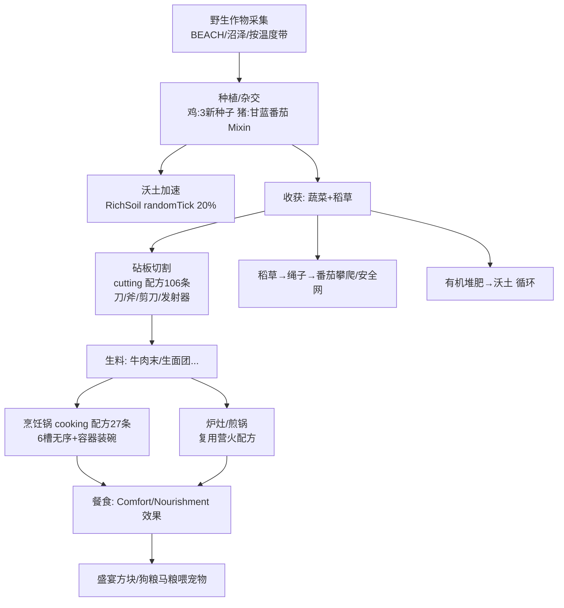

# 03 — 工作流分析报告

> 路径未加前缀时均相对 `src/main/java/com/nhoryzon/mc/farmersdelight/` 或仓库根。

## 1. 开发与交付工作流（CI/CD）

### 1.1 管线结构（`.circleci/config.yml`）

```
workflow: build-release-deploy
├─ build_n_test     触发：任意分支 + 任意 tag
│    └─ gradle clean build test（gradle:7.3-jdk17 镜像，Gradle 缓存按 build.gradle 校验和）
│    └─ 收集 JUnit XML 测试结果（实际无测试，恒空）
├─ code_analysis    【已注释停用】SonarQube（需要 sonar-analysis context）
├─ release          触发：仅 master 分支；前置 build_n_test
│    └─ git checkout --force develop   ← ⚠ 当前仓库无 develop 分支，此任务在现状下必然失败
│    └─ gradle clean release -Prelease_commit_prefix=... -Pdevelopment_commit_prefix=...
└─ deploy           【已注释停用】gradle clean publish → Maven 仓库（需要 maven-public context）
```

### 1.2 版本发布机制（gradle-release-plugin，`build.gradle:92-105`）

- `tagTemplate = "$minecraft_version-$version"` → 形如 `1.20.1-1.4.3` 的 tag。
- `pushReleaseVersionBranch = 'master'`；`requireBranch = /master|develop/`。
- 流程：release 任务自动 `gradle.properties` 去掉 `-SNAPSHOT` → commit（消息前缀 `[skip ci][gradle-release-plugin] prepare release`）→ 打 tag → 升下一版本号加 `-SNAPSHOT` → 再 commit（`prepare for next development iteration`）。Git 历史中的 `08a0ae2`、`250d416` 等提交即此产物。
- **⚠ 现状矛盾**：release 任务硬编码 checkout `develop`，但仓库只有 `master`（`git branch -a` 仅 master）。历史上存在 develop→master 的 PR 合并（如 `834210b`），推测 develop 分支被删除或未同步到本 fork。**在本地复刻发布前必须先理顺分支**。

### 1.3 本地开发流程

```bash
./gradlew build          # 产物 build/libs/farmers-delight-fabric-1.20.1-1.4.3.jar（+sources+javadoc）
./gradlew runClient      # loom 提供的开发客户端（本地运行时含 REI/ModMenu/ClothConfig，build.gradle:48-58）
./gradlew genSources     # 反编译 Minecraft 源码供查阅（loom）
./gradlew test           # 无测试，空任务
```

发布到 Maven 的凭证/URL 均由 `-P` 参数注入（deploy 任务，当前停用）。

### 1.4 测试策略

**无任何自动化测试**（无 src/test 目录、无 `*Test*.java`）。回归依赖：
1. 编译期类型检查（yarn 映射改名会在编译时暴露大部分 Mixin/覆写断裂）；
2. `gradle runClient` 手工游戏内验证；
3. 社区 issue 反馈（README.md:17 指引到 GitHub issue tracker）。

## 2. 数据资产结构（data/，模组的「业务数据」）

`src/main/resources/data/` 下共 5 个命名空间（`farmersdelight` 631 文件 + 兼容命名空间）：

| 命名空间 | 内容 | 用途 |
|---|---|---|
| `farmersdelight/` | 见下表 | 本体数据 |
| `minecraft/tags/` | 16 个标签（climbable、crops、dirt、mineable/*、standing_signs、maintains_farmland 等） | 把模组方块挂入原版标签体系 |
| `c/tags/` | farmland、mineable/knife、cooked_beef/bacon/chicken/fishes 等约 10+ 个 | Convention 命名空间（跨模组通用标签） |
| `create/` | milling/mixing/filling 12 个配方 | Create 模组联动（装了才生效） |
| `dehydration/` | 少量 | Dehydration 模组联动 |

`data/farmersdelight/` 明细：

| 目录 | 数量 | 说明 |
|---|---|---|
| `recipes/` | 293 | 根目录 148（shapeless 72 / shaped 47 / smelting 10 / smoking 9 / campfire 7 / blasting 2 / smithing 1，其中 3 个带 `vanilla_crates_enabled` 资源条件）；`cooking/` 27（全部 `farmersdelight:cooking`）；`cutting/` 106（全部 `farmersdelight:cutting`，含 55 处 `farmersdelight:tool` 动作定义） |
| `advancements/` | 191 | `main/` 22 个主线（root→craft_knife→use_cutting_board→…→master_chef）+ `recipes/` 169 个配方解锁 |
| `loot_tables/` | 100 | `blocks/` 70 + `inject/` 30（3 blocks 草/小麦掉稻草种子、15 chests、12 entities 刀割副产品），由 `FarmersDelightMod.registerLootTable:257-300` 在加载时注入原版表 |
| `worldgen/` | 19 | 10 configured_feature + 9 placed_feature（7 种野生作物 + 2 蘑菇菌丛〔未挂接〕）；placed 层统一 `rarity_filter + in_square + heightmap + biome + farmersdelight:biome_is_overworld` |
| `tags/` | 22 | blocks 11（heat_sources、tray_heat_sources、heat_conductors、compost_activators、drops_cake_slice、mineable/knife、mushroom_colony_growable_on、ropes、straw_blocks、unaffected_by_rich_soil、wild_crops）；items 9（comfort_foods、cabbage_roll_ingredients、cabinets(+wooden)、canvas_signs、offhand_equipment、straw_harvesters、wild_crops、wolf_prey）；entity_types 2（dog/horse_feed_users） |
| `structures/village/houses/` | 5 | 5 种村庄风格堆肥堆小屋 NBT，运行时注入 houses 结构池 |
| `damage_type/` | 1 | `stove_burn.json`（炉灶烧伤，`StoveBlock.java:59-60` 引用） |
| `weapon_attributes/` | 1 | `skillet.json`（煎锅武器属性，供武器属性类模组读取） |

**代码↔数据契约速查**（改数据必须同步检查的点）：

| 数据 | 代码消费方 |
|---|---|
| `recipes/cooking/*.json` | `CookingPotRecipe(Serializer)`；槽位≤6、`cookingtime` 默认 200、container 缺省取输出 remainder |
| `recipes/cutting/*.json` | `CuttingBoardRecipe(Serializer)`；恰好 1 输入 + tool + ≤4 ChanceResult + 可选 sound |
| `tags/.../heat_sources 等` | `HeatableBlockEntity:11-32`、`TagsRegistry:22-24`、`OrganicCompostBlock`、`RichSoilBlock` |
| `tags/items/comfort_foods` | `LivingEntityOnUseItemFinishMixin:29-37` + 客户端 tooltip（`FarmersDelightModClient.java:58-74`） |
| `tags/entity_types/{dog,horse}_feed_users` | `DogFoodItem.canFeed:47-55` / `HorseFeedItem.canFeed:40-48` |
| `loot_tables/inject/**` | `FarmersDelightMod.registerLootTable` 中三组 ID 白名单（`:258-288`） |
| `structures/village/houses/*_compost_pile` | `addToStructurePool:155-169` 与权重表 `:140-145` |
| `worldgen/placed_feature/*.json` 的 rarity | `Configuration.chanceWild*`（语义重复，需双向同步） |

## 3. 核心业务工作流（玩家视角）

### 3.1 主线进度树（advancements/main，22 个）

```
root（获得任一 FD 物品）
├─ craft_knife（做刀）→ use_cutting_board（砧板切一次）
├─ place_cooking_pot → （煮菜链）
├─ place_skillet → use_skillet
├─ place_organic_compost → get_rich_soil（获得沃土）
├─ plant_rice / harvest_straw / harvest_ropelogged_tomato / get_mushroom_colony
├─ eat_comfort_food / eat_nourishing_food
├─ place_campfire → place_feast → get_ham
├─ hit_raider_with_rotten_tomato / obtain_netherite_knife
├─ get_fd_seed → plant_all_crops（种齐全部作物）
└─ master_chef（终极）
```

### 3.2 「从农场到餐桌」全链路（模组核心玩法闭环）



### 3.3 关键决策树：烹饪锅交互（`CookingPotBlock.onUse:206-226`）

```
玩家右键烹饪锅
├─ 空手潜行？ ─ 是 → 切换支撑模式（HANDLE↔TRAY/NONE），结束
├─ 手持物品？ ─ 是（服务端）
│   ├─ 是当前餐的有效容器？（isContainerValid:446）
│   │   ├─ 是 → 容器-1，取一份餐入背包/掉落，结束
│   │   └─ 否 → 打开 GUI（ScreenHandler + PropertyDelegate）
└─ 空手 → 打开 GUI
每 tick（服务端 cookingTick:161）：
├─ 加热？（HEAT_SOURCES 直热 / HEAT_CONDUCTORS 传导）
│   └─ 否 → cookTime -= 2（进度衰减）
├─ 有输入 + 匹配配方 + 可输出？
│   └─ 是 → cookTime++；到时合成、记账经验、消耗原料、抛出原料容器
└─ 成品在餐盘槽？
    ├─ 无容器餐 → 自动移到输出槽
    └─ 有容器餐 + 容器槽有货 → 自动装碗到输出槽
```

### 3.4 决策树：砧板（`CuttingBoardBlock.onUse:105-171` + 事件）

```
右键砧板
├─ 板上无物
│   ├─ 主手非方块物品 且 副手有非 offhand_equipment 物品 → 拒绝放置
│   └─ 否则 addItem（1 个，薄板放置音）
├─ 板上有物 + 手持工具/食物
│   ├─ 潜行 + ToolItem/三叉戟/剪刀（CuttingBoardEventListener:28-47）→ carveToolOnBoard 雕刻展示
│   └─ processItemUsingTool:
│       ├─ 匹配配方失败 → 提示 invalid_item / invalid_tool（仅玩家）
│       └─ 成功 → 概率产出弹向左侧 + 工具耐久-1 + 音效 + 清板 + 进度触发
└─ 板上有物 + 空手 → 取回（创造删除；背包满散落）
```

### 3.5 业务规则常量表（硬编码阈值）

| 常量 | 值 | 位置 |
|---|---|---|
| 烹饪默认时长 | 200 tick | `CookingPotRecipeSerializer.java:43` |
| 篮子吸取冷却 | 8 tick | `BasketBlockEntity.java:116-120` |
| 篮子吸取距离 | 朝向侧 1 格 | `BasketBlockEntity.java:40-47` |
| Comfort 回血节律 | 80 tick/1 HP | `ComfortEffect.java:37-39` |
| Nourishment 每刻消疲惫上限 | 4.0 | `NourishmentEffect.java:31-33` |
| 稻穗生长速度 | 普通 1/3 | `RiceUpperCropBlock.java:55-57` |
| 番茄藤攀绳概率 | 30% | `TomatoVineBlock.java:179-195` |
| 采烂番茄概率 | 5% | `TomatoVineBlock.java:63` |
| 背刺倍率 | ×(1.2+0.2×等级) | `BackstabbingEnchantment.java:59-62` |
| 背刺判定锥 | 点积 < -0.5（约 120°） | `BackstabbingEnchantment.java:49-57` |
| 炉灶亮度/烧伤 | 13 / 1 HP | `StoveBlock.java:66, 174-182` |
| 煎锅手持烹饪时长 | 配方 20% - 火附魔 5%/级，下限 60 tick | `SkilletBlock.java:196-208` |
| 拉绳敲钟搜索高度 | 24 格 | `RopeBlock.java:85-99` |
| 原版汤舒适时长 | 6000 tick | `Configuration.java:20` |
| 兔子煲跳跃时长 | 200 tick | `Configuration.java:21` |
| 汤堆叠上限 | 16 | `ItemMixin:21-28` |
| 村庄注入权重 | plains5/savanna4/taiga4/snowy3/desert3 | `FarmersDelightMod.java:140-145` |

### 3.6 异常/降级路径

| 场景 | 处理 | 位置 |
|---|---|---|
| 烹饪锅无热源 | 进度每 tick -2 衰减（不清空、不丢料） | `CookingPotBlockEntity.java:172-174` |
| 炉灶上方被遮挡 | 立即散落全部烤架物品（防卡死） | `StoveBlockEntity.java:92-95` |
| 砧板失去下方支撑 | 方块自毁变空气（物品经 onStateReplaced 散落） | `CuttingBoardBlock.java:186-194` |
| 手持煎锅中途取消 | 生食材经 offerOrDrop 归还 | `SkilletItem.java:143-155` |
| 破坏带状态的 BE | loot 函数把 NBT 快照写入掉落物（锅带餐、煎锅带食物与附魔） | `CopyMealFunction.java:23-32`、`CopySkilletFunction.java:24-33` |
| 装碗容器不匹配 | actionbar 提示，不消耗 | `FeastBlock.java:149-151`、`CookingPotBlock.onUse` |
| 结构池不存在 | WARN 日志跳过 | `FarmersDelightMod.java:168` |
| 配方 JSON 非法 | JsonParseException，该配方不加载 | 各 Serializer `read` |

## 4. 第三方集成工作流

- **REI**（`integration/rei/`）：`FarmersDelightModREI` 注册三个分类目录 — `cooking/`（烹饪锅展示：ChanceArrayIngredient 处理多食材）、`cutting/`（切割展示：工具+概率产出）、`decomposition/`（分解展示）。纯展示层，不影响服务端逻辑。
- **ModMenu**（`integration/modmenu/`）：`Entry`/`Category` 提供配置界面入口（链接 Discord、打开配置文件目录等轻量交互）。
- **Create**：仅数据侧 12 个配方（milling/mixing/filling），无 Java 代码耦合。
- **Raised / AppleSkin**：HUD 覆盖层读取 `raised:distance` 属性兼容偏移（`NourishmentHungerOverlay.java:76-78`）；`BeforeInc` 注入点借用 AppleSkin 的 AtCode 命名空间（`mixin/util/BeforeInc.java:17`）。
